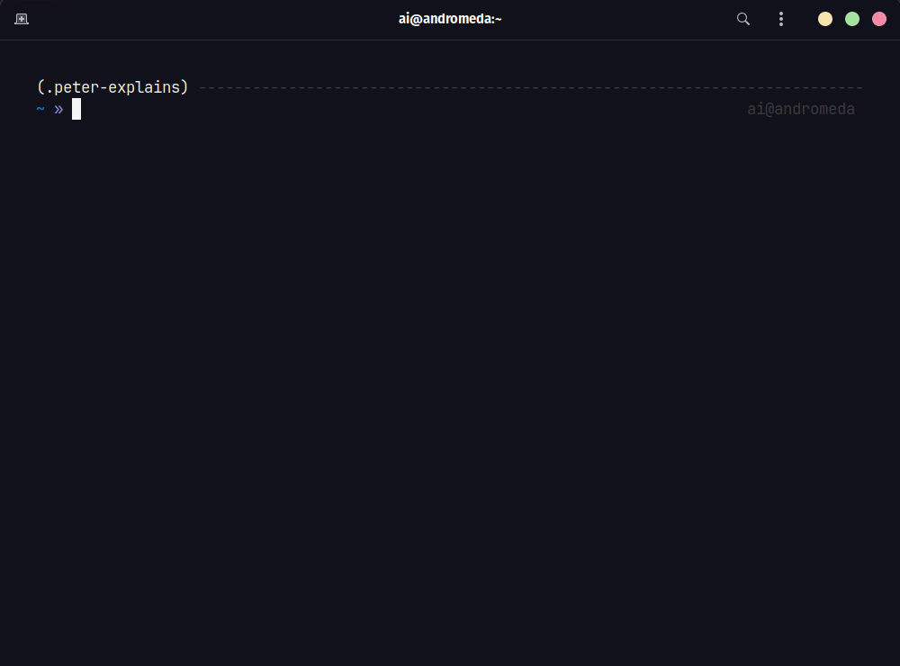

## **`peter`: Your Linux Command Translator (Peter Griffin Edition)**

Hey Lois, ever wanted to understand those geeky Linux commands but were afraid you'd end up more confused than a monkey trying to do its taxes? Well, fear no more! `peter` is here to break down those brainy terminal things in a way even I can understand (well, mostly).

### **How the Heck Does This Work?**

1. **You type somethin' like:** `peter ls` or `peter "grep hello world.txt"`
2. **I whip out my trusty Gemini AI translator:** This thing's smarter than Stewie after a bowl of spinach, and it'll turn that boring 'ls' command into a hilarious hot mess of an explanation.
3. **You laugh (or groan), but hey, at least you learn somethin':** Maybe you'll actually remember what those commands do instead of just blindly copying stuff from the internet like a parrot.

### **Gettin' Started (For Dummies Like Me)** 

1. **Make sure you got that pip thing installed:** You know, for downloading packages and stuff. If you don't, Lois help you.
2. **Use pip to install this amazingness:** `pip install peter-explains`
3. **Boom! Unleash the Peter:** Try something like `peter grep`. Just don't ask me to explain it – that's the AI's job.

### Retep is gonna ruin your day if you try to use without the API KEY

    Don't worry. Meg's here to help. You need a FREE Google Gemini API KEY.

    - Get yours from here: [https://aistudio.google.com/app/](https://aistudio.google.com/app/)
    - Add the `API KEY` your Environment by running the following:

      $ export GOOGLE_API_KEY=YOUR_KEY

    - (Recommended) Add this line to your `.bashrc` or `.zshrc`

### Help

    Run the following for help

    $ peter --help

Need more?

    

### **For the Brainiacs (a.k.a. Potential Contributors)**

Hey Meg, turns out even _I_ can't make this thing perfect on my own. If you're the type who knows their way around Python and AI, feel free to poke around the code and make it even funnier (or, dare I say, _educational_).

### **Disclaimer** 

I ain't responsible if this tool makes you dumber, offends your delicate sensibilities, or causes your computer to explode. Use at your own risk, and remember: laughter is the best medicine... unless you're choking on a hot dog. Then you probably need a doctor.

**Let me know if you want me to make it even more absurd or add specific installation instructions based on your project setup!**
